# BMAD-METHOD™ vs Spec Kit：全面工具分析与适用场景指南

## 📋 目录

- [执行摘要](#执行摘要)
- [工具本质分析](#工具本质分析)
- [用户画像深度分析](#用户画像深度分析)
- [适用场景矩阵](#适用场景矩阵)
- [技术能力对比](#技术能力对比)
- [学习成本与ROI分析](#学习成本与roi分析)
- [团队规模适配](#团队规模适配)
- [项目生命周期适用性](#项目生命周期适用性)
- [行业领域适配](#行业领域适配)
- [决策框架](#决策框架)
- [实施建议](#实施建议)
- [未来发展预测](#未来发展预测)

## 执行摘要

### 核心发现

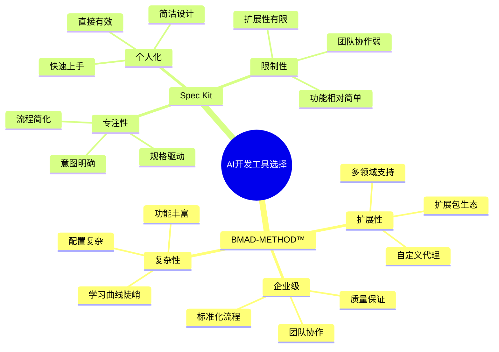

### 关键差异总结

| 维度 | BMAD-METHOD™ | Spec Kit |
|------|-------------|----------|
| **设计哲学** | 企业级AI代理协作平台 | 个人规格驱动开发工具 |
| **目标用户** | 中大型开发团队 | 个人开发者和小团队 |
| **核心优势** | 完整的敏捷开发生态 | 简洁高效的开发流程 |
| **学习成本** | 高（需要理解代理概念） | 低（直观的命令流程） |
| **扩展能力** | 强（多领域扩展包） | 中（模板和脚本扩展） |
| **适用场景** | 复杂项目、团队协作 | 快速原型、个人项目 |

## 工具本质分析

### BMAD-METHOD™ 本质特征

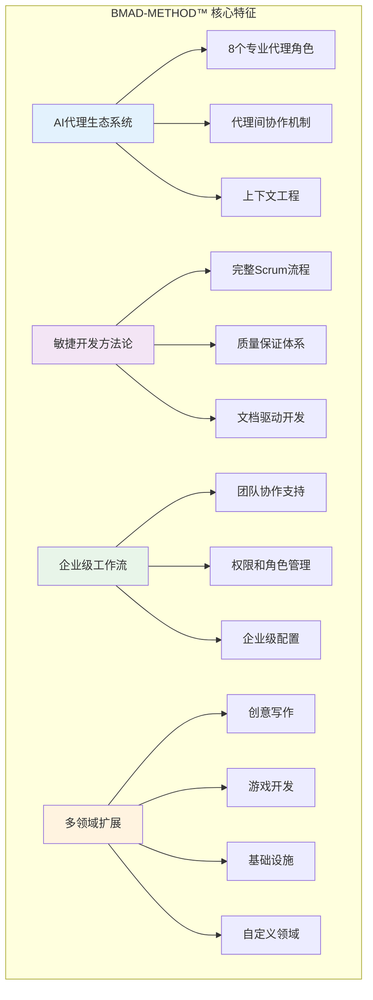

**BMAD-METHOD™ 的本质**：
- 🏢 **企业级AI协作平台**：不仅是工具，更是一套完整的开发方法论
- 🤖 **AI代理生态系统**：每个代理都有专门的角色和职责
- 🔄 **流程标准化引擎**：将敏捷开发流程AI化和自动化
- 🌐 **多领域扩展框架**：可以扩展到任何专业领域

### Spec Kit 本质特征

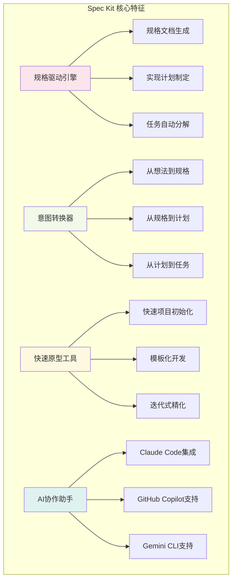

**Spec Kit 的本质**：
- 📝 **规格驱动开发工具**：将规格说明书作为开发的核心驱动力
- ⚡ **快速原型生成器**：从想法快速转换为可执行的开发计划
- 🎯 **意图明确化工具**：帮助开发者明确"是什么"和"为什么"
- 🤝 **AI协作增强器**：深度集成AI助手，提升开发效率

## 用户画像深度分析

### BMAD-METHOD™ 目标用户

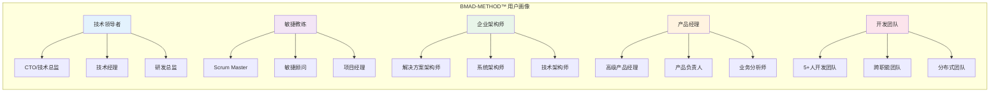

**BMAD-METHOD™ 典型用户特征**：
- 👔 **管理层导向**：需要标准化流程和质量保证
- 🏢 **企业环境**：在中大型公司或组织中工作
- 📊 **流程重视者**：重视规范化和可重复的开发流程
- 🎯 **质量关注者**：对代码质量和项目质量有高要求
- 🤝 **团队协作者**：需要多人协作和角色分工

### Spec Kit 目标用户

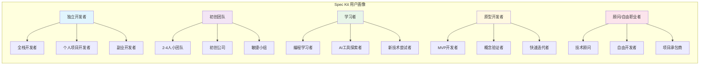

**Spec Kit 典型用户特征**：
- 🚀 **效率导向**：追求快速开发和即时反馈
- 💡 **创新探索者**：喜欢尝试新工具和新方法
- ⚡ **快速迭代者**：需要快速验证想法和概念
- 🎯 **目标明确者**：有清晰的项目目标和时间限制
- 🔧 **工具实用主义者**：选择最简单有效的工具

## 适用场景矩阵

### 项目类型适用性分析

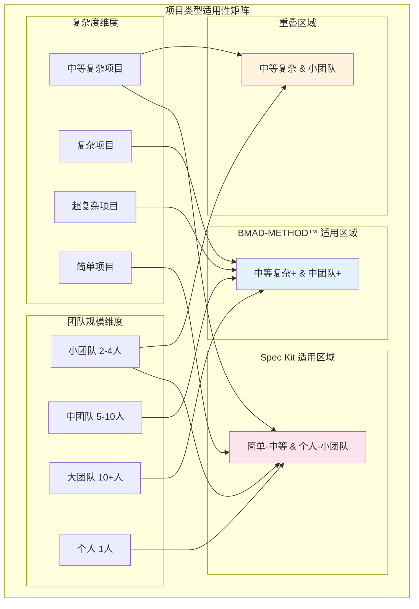

### 详细场景分析

#### 🎯 强烈推荐 BMAD-METHOD™ 的场景

1. **企业级软件开发**
   - 多团队协作的大型项目
   - 需要严格质量控制的关键系统
   - 长期维护的企业应用

2. **复杂业务系统**
   - ERP、CRM等企业管理系统
   - 金融、医疗等高合规要求系统
   - 多模块集成的复杂架构

3. **多领域项目**
   - 需要游戏开发扩展包的项目
   - 创意写作和内容管理系统
   - 基础设施和DevOps自动化

4. **标准化要求高的环境**
   - 需要统一开发流程的组织
   - 多项目并行的开发团队
   - 需要知识传承的团队

#### ⚡ 强烈推荐 Spec Kit 的场景

1. **快速原型开发**
   - MVP（最小可行产品）开发
   - 概念验证项目
   - 创业公司早期产品

2. **个人项目**
   - 副业项目开发
   - 学习项目实践
   - 个人工具开发

3. **小团队敏捷开发**
   - 2-4人的初创团队
   - 快速迭代的产品开发
   - 时间紧迫的项目

4. **学习和实验**
   - AI辅助开发的学习
   - 新技术栈的探索
   - 开发流程的优化实验

## 技术能力对比

### 架构复杂度对比

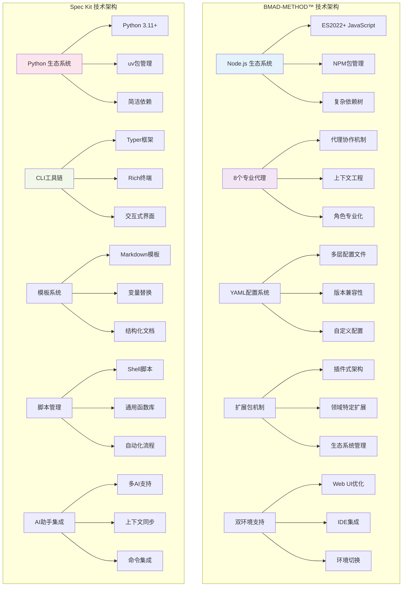

### 功能深度对比

| 功能领域 | BMAD-METHOD™ | Spec Kit | 详细对比 |
|----------|-------------|----------|----------|
| **项目初始化** | ⭐⭐⭐ | ⭐⭐⭐⭐⭐ | Spec Kit更简洁直接 |
| **需求分析** | ⭐⭐⭐⭐⭐ | ⭐⭐⭐ | BMAD有专门的分析师代理 |
| **架构设计** | ⭐⭐⭐⭐⭐ | ⭐⭐⭐⭐ | BMAD有专门的架构师代理 |
| **任务分解** | ⭐⭐⭐⭐ | ⭐⭐⭐⭐ | 两者都有良好支持 |
| **代码生成** | ⭐⭐⭐ | ⭐⭐⭐⭐ | Spec Kit更直接 |
| **质量保证** | ⭐⭐⭐⭐⭐ | ⭐⭐⭐ | BMAD有专门的QA代理 |
| **团队协作** | ⭐⭐⭐⭐⭐ | ⭐⭐ | BMAD明显优势 |
| **文档管理** | ⭐⭐⭐⭐⭐ | ⭐⭐⭐⭐ | BMAD更全面 |
| **扩展性** | ⭐⭐⭐⭐⭐ | ⭐⭐⭐ | BMAD扩展包机制强大 |
| **学习曲线** | ⭐⭐ | ⭐⭐⭐⭐⭐ | Spec Kit更容易上手 |

### 性能特征对比

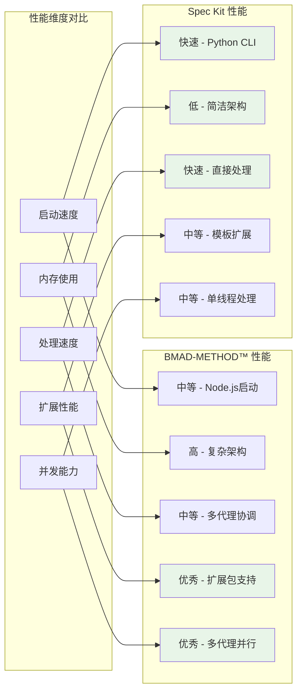

## 学习成本与ROI分析

### 学习曲线对比

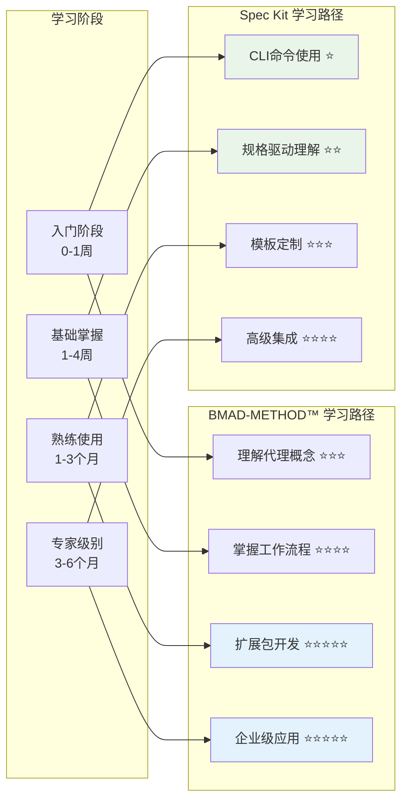

### ROI（投资回报率）分析

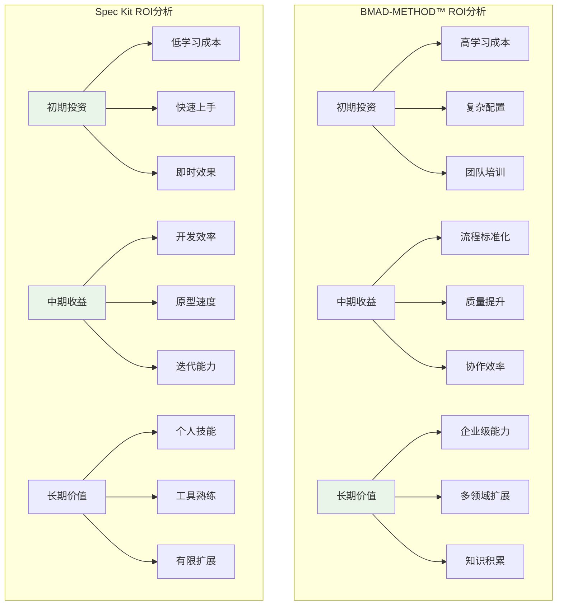

### 成本效益分析

| 成本类型 | BMAD-METHOD™ | Spec Kit | 说明 |
|----------|-------------|----------|------|
| **学习成本** | 高（2-4周） | 低（1-3天） | Spec Kit明显优势 |
| **配置成本** | 高（复杂配置） | 低（简单配置） | Spec Kit更简洁 |
| **维护成本** | 中（定期更新） | 低（轻量维护） | Spec Kit维护简单 |
| **扩展成本** | 低（扩展包机制） | 中（手动扩展） | BMAD扩展更容易 |
| **团队成本** | 高（需要培训） | 低（个人使用） | 取决于团队规模 |
| **长期收益** | 高（企业级价值） | 中（个人效率） | BMAD长期价值更高 |

## 团队规模适配

### 团队规模与工具选择矩阵

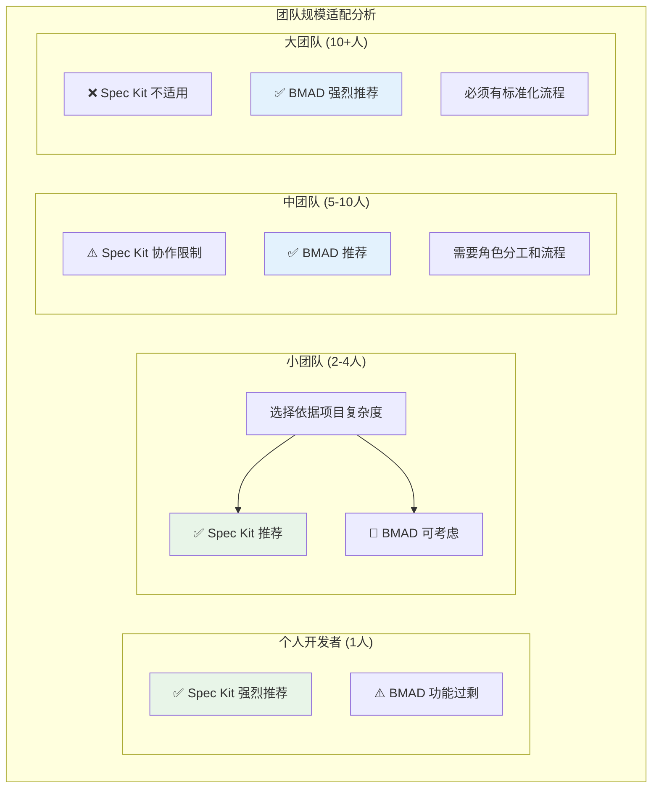

### 团队协作能力对比

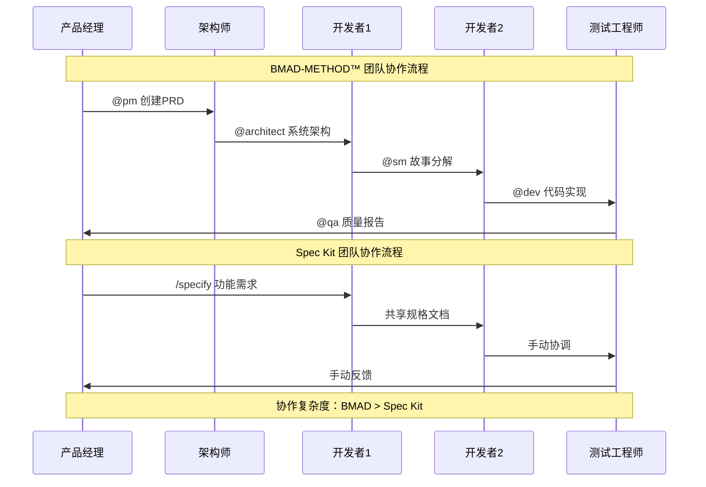

## 项目生命周期适用性

### 项目阶段适用性分析

```mermaid
gantt
    title 项目生命周期工具适用性
    dateFormat X
    axisFormat %s

    section 概念阶段
    Spec Kit 优势     :active, concept-spec, 0, 2
    BMAD 可用        :concept-bmad, 0, 2

    section 规划阶段
    BMAD 优势        :active, plan-bmad, 2, 4
    Spec Kit 可用     :plan-spec, 2, 4

    section 开发阶段
    BMAD 优势        :active, dev-bmad, 4, 8
    Spec Kit 适用     :dev-spec, 4, 6

    section 测试阶段
    BMAD 优势        :active, test-bmad, 6, 9
    Spec Kit 有限     :test-spec, 6, 7

    section 维护阶段
    BMAD 优势        :active, maintain-bmad, 8, 12
    Spec Kit 有限     :maintain-spec, 8, 9
```

### 详细阶段分析

#### 🚀 项目启动阶段（0-2周）

**Spec Kit 优势**：
- ⚡ 快速项目初始化
- 📝 即时规格文档生成
- 🎯 快速概念验证
- 💡 想法快速转化

**BMAD-METHOD™ 挑战**：
- 🐌 复杂的初始配置
- 📚 需要学习代理概念
- ⚙️ 扩展包选择困难

#### 📋 规划设计阶段（2-4周）

**BMAD-METHOD™ 优势**：
- 🎭 专业代理角色分工
- 📊 完整的PRD和架构文档
- 🔍 深度需求分析
- 🏗️ 系统性架构设计

**Spec Kit 限制**：
- 👤 缺乏专业角色支持
- 📄 文档深度有限
- 🤝 团队协作困难

#### 💻 开发实施阶段（4-8周）

**BMAD-METHOD™ 优势**：
- 📖 详细的用户故事
- 🔄 标准化开发流程
- 👥 多角色协作支持
- 🛡️ 内置质量保证

**Spec Kit 适用性**：
- ⚡ 快速迭代开发
- 🎯 简单直接的任务
- 👤 个人开发效率高

#### 🧪 测试验证阶段（6-9周）

**BMAD-METHOD™ 优势**：
- 🔍 专门的QA代理
- ✅ 完整的测试策略
- 📋 质量检查清单
- 🔄 测试-修复循环

**Spec Kit 限制**：
- 🤷 缺乏专门测试支持
- 📝 手动测试规划
- 👤 依赖个人经验

#### 🔧 维护演进阶段（8周+）

**BMAD-METHOD™ 优势**：
- 📚 完整的文档体系
- 🔄 持续改进流程
- 👥 团队知识传承
- 🌱 功能扩展支持

**Spec Kit 限制**：
- 📄 文档维护困难
- 👤 个人依赖性强
- 🔒 扩展能力有限

## 行业领域适配

### 行业适用性热力图

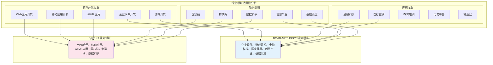

### 详细行业分析

#### 🏢 企业软件开发

**BMAD-METHOD™ 优势**：
- 🎭 完整的角色分工（PM、架构师、QA等）
- 📊 企业级文档和流程管理
- 🛡️ 严格的质量保证体系
- 🔄 长期维护和演进支持
- 👥 多团队协作能力

**适用项目**：ERP系统、CRM平台、企业门户、工作流系统

#### 🎮 游戏开发

**BMAD-METHOD™ 独特优势**：
- 🎯 专门的游戏开发扩展包
- 🎨 创意和技术的平衡
- 🏗️ 复杂游戏架构支持
- 👥 多角色团队协作（策划、美术、程序）

**支持的游戏引擎**：
- Godot（bmad-godot-game-dev）
- Unity 2D（bmad-2d-unity-game-dev）
- Phaser（bmad-2d-phaser-game-dev）

#### 💻 Web应用开发

**Spec Kit 优势**：
- ⚡ 快速原型开发
- 🎯 MVP快速验证
- 🔄 敏捷迭代开发
- 👤 个人或小团队效率高

**适用项目**：SaaS应用、电商网站、内容管理系统、API服务

#### 🤖 AI/ML应用开发

**Spec Kit 优势**：
- 🧪 实验性项目支持
- 📊 数据科学工作流
- ⚡ 快速概念验证
- 🔬 研究导向开发

**适用项目**：机器学习模型、数据分析工具、AI应用原型

### 合规性要求对比

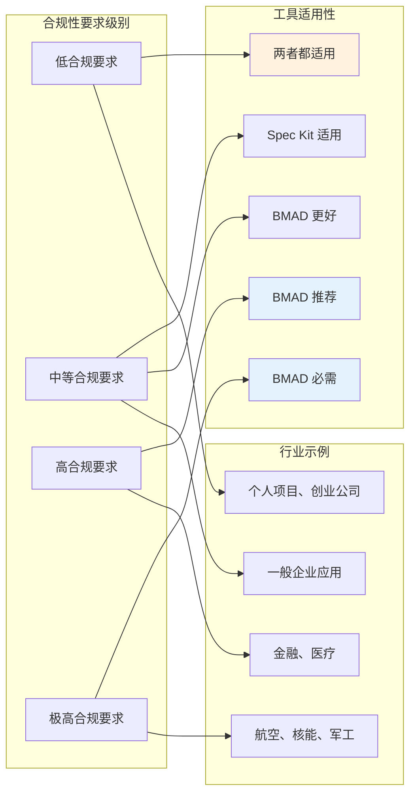

## 决策框架

### 智能决策树

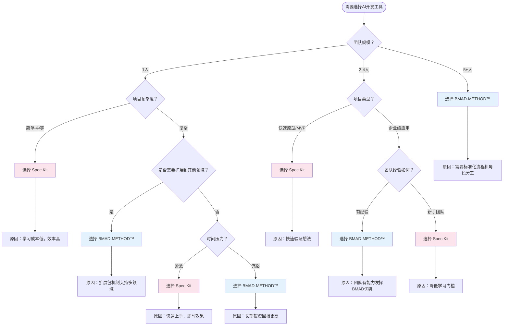

### 评分决策模型

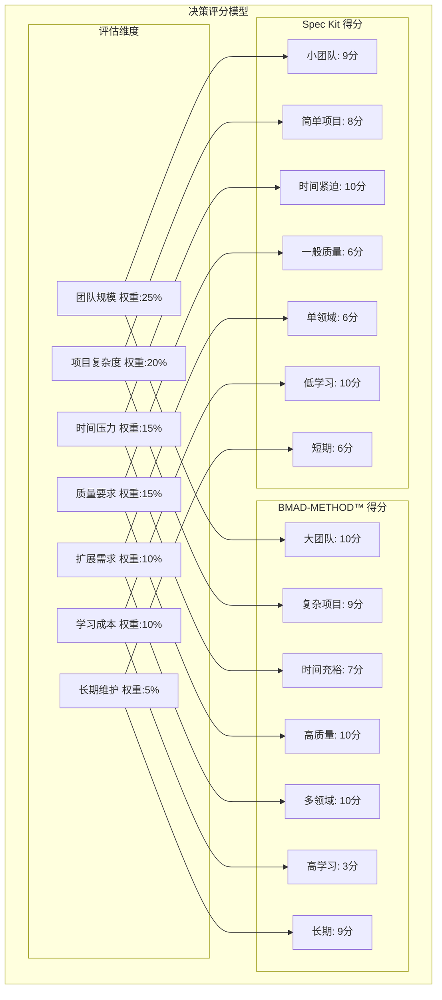

**计算公式**：
- BMAD-METHOD™ 总分 = 10×0.25 + 9×0.20 + 7×0.15 + 10×0.15 + 10×0.10 + 3×0.10 + 9×0.05 = **8.4分**
- Spec Kit 总分 = 9×0.25 + 8×0.20 + 10×0.15 + 6×0.15 + 6×0.10 + 10×0.10 + 6×0.05 = **8.2分**

### 关键决策因子

#### 🎯 选择 BMAD-METHOD™ 的关键因子

1. **团队规模 ≥ 5人**
   - 需要角色分工和协作
   - 标准化流程的价值显现
   - 知识传承和团队建设

2. **项目复杂度高**
   - 多模块、多层次架构
   - 复杂的业务逻辑
   - 长期维护需求

3. **质量要求严格**
   - 企业级应用
   - 关键业务系统
   - 合规性要求

4. **多领域扩展需求**
   - 游戏开发
   - 创意写作
   - 基础设施管理

#### ⚡ 选择 Spec Kit 的关键因子

1. **快速开发需求**
   - MVP开发
   - 概念验证
   - 时间紧迫的项目

2. **个人或小团队**
   - 1-4人的开发团队
   - 个人项目或副业
   - 初创公司早期

3. **学习成本敏感**
   - 新手开发者
   - 快速上手需求
   - 工具简洁性要求

4. **原型和实验**
   - 技术探索
   - 新想法验证
   - 快速迭代需求

## 实施建议

### BMAD-METHOD™ 实施路径

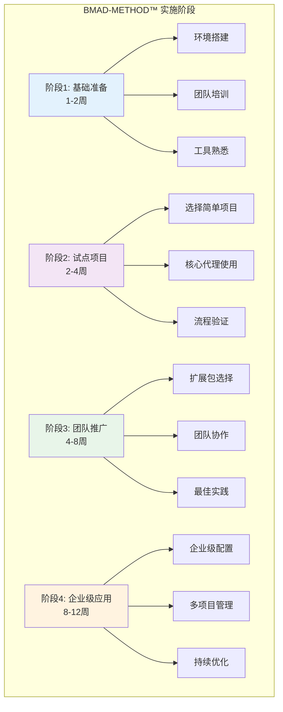

### Spec Kit 实施路径

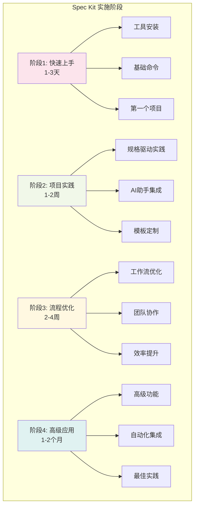

### 混合使用策略

```mermaid
graph LR
    subgraph "混合使用场景"
        M1[学习阶段]
        M2[原型阶段]
        M3[开发阶段]
        M4[维护阶段]

        M1 --> M1_TOOL[使用 Spec Kit 学习]
        M2 --> M2_TOOL[使用 Spec Kit 原型]
        M3 --> M3_TOOL[切换到 BMAD-METHOD™]
        M4 --> M4_TOOL[继续使用 BMAD-METHOD™]
    end

    subgraph "团队成长路径"
        T1[个人开发者]
        T2[小团队]
        T3[中大团队]

        T1 --> T1_TOOL[Spec Kit]
        T2 --> T2_TOOL[Spec Kit → BMAD]
        T3 --> T3_TOOL[BMAD-METHOD™]
    end

    style M1_TOOL fill:#fce4ec
    style M2_TOOL fill:#fce4ec
    style M3_TOOL fill:#e3f2fd
    style M4_TOOL fill:#e3f2fd

## 未来发展预测

### 技术发展趋势

```mermaid
timeline
    title AI开发工具发展趋势

    section 2024-2025 当前阶段
        BMAD-METHOD™ v4.x : 代理系统成熟
                          : 扩展包生态
                          : 企业级应用
        Spec Kit v0.x     : 规格驱动开发
                          : AI助手集成
                          : 快速原型

    section 2025-2026 发展阶段
        BMAD-METHOD™ v5.x : 可视化界面
                          : 云端协作
                          : AI模型集成
        Spec Kit v1.x     : 功能增强
                          : 性能优化
                          : 团队功能

    section 2026-2027 成熟阶段
        BMAD-METHOD™ v6.x : 企业级功能
                          : 标准化制定
                          : 生态市场
        Spec Kit v2.x     : IDE插件
                          : 插件系统
                          : 企业版本

    section 2027+ 未来愿景
        行业标准化        : AI开发流程标准
                          : 工具互操作性
                          : 生态系统融合
```

### 市场定位演进

```mermaid
graph TB
    subgraph "当前市场定位"
        Current_BMAD[BMAD-METHOD™<br/>企业级AI代理平台]
        Current_SPEC[Spec Kit<br/>个人规格驱动工具]
    end

    subgraph "未来市场定位"
        Future_BMAD[BMAD-METHOD™<br/>AI开发生态系统领导者]
        Future_SPEC[Spec Kit<br/>轻量级AI开发助手]
    end

    subgraph "发展方向"
        BMAD_DIR[向上扩展<br/>企业级、标准化、生态化]
        SPEC_DIR[向下深入<br/>个人化、专业化、集成化]
    end

    Current_BMAD --> BMAD_DIR
    Current_SPEC --> SPEC_DIR
    BMAD_DIR --> Future_BMAD
    SPEC_DIR --> Future_SPEC

    style Future_BMAD fill:#e3f2fd
    style Future_SPEC fill:#fce4ec
```

### 竞争格局预测

```mermaid
graph LR
    subgraph "AI开发工具竞争格局"
        subgraph "企业级市场"
            E1[BMAD-METHOD™]
            E2[GitHub Copilot Enterprise]
            E3[JetBrains AI]
            E4[Microsoft AI Dev Tools]
        end

        subgraph "个人/小团队市场"
            P1[Spec Kit]
            P2[Cursor AI]
            P3[Replit AI]
            P4[Claude Code]
        end

        subgraph "新兴竞争者"
            N1[AI原生IDE]
            N2[云端AI开发平台]
            N3[垂直领域AI工具]
        end
    end

    E1 --> E1_ADV[代理生态优势]
    P1 --> P1_ADV[规格驱动优势]

    style E1 fill:#e3f2fd
    style P1 fill:#fce4ec
```

### 技术融合趋势

**BMAD-METHOD™ 可能的发展方向**：
1. **AI模型深度集成**：支持更多AI模型和平台
2. **可视化开发界面**：图形化的代理协作界面
3. **云端协作平台**：团队云端同步和协作
4. **行业标准制定**：成为AI代理开发的行业标准
5. **生态系统扩展**：第三方扩展包市场

**Spec Kit 可能的发展方向**：
1. **IDE深度集成**：成为主流IDE的插件
2. **团队协作功能**：增强小团队协作能力
3. **AI助手扩展**：支持更多AI助手平台
4. **垂直领域特化**：针对特定领域的优化
5. **企业版本**：面向企业的增强功能

## 总结与建议

### 核心结论

```mermaid
mindmap
  root((工具选择核心结论))
    BMAD-METHOD™
      适用场景
        企业级项目
        复杂系统开发
        团队协作需求
        长期维护项目
      核心价值
        标准化流程
        质量保证体系
        多领域扩展
        知识传承
      投资建议
        长期投资
        团队培训
        逐步推广
        持续优化
    Spec Kit
      适用场景
        个人项目
        快速原型
        MVP开发
        学习实验
      核心价值
        快速上手
        高效开发
        简洁设计
        即时效果
      投资建议
        短期收益
        个人技能
        工具熟练
        效率提升
```

### 最终建议矩阵

| 场景类型 | 推荐工具 | 理由 | 实施建议 |
|----------|----------|------|----------|
| **个人开发者** | Spec Kit | 学习成本低，效率高 | 立即开始使用 |
| **2-4人小团队** | Spec Kit → BMAD | 根据项目复杂度选择 | 先用Spec Kit，复杂项目考虑BMAD |
| **5-10人中团队** | BMAD-METHOD™ | 需要标准化流程 | 投资培训，逐步推广 |
| **10+人大团队** | BMAD-METHOD™ | 必须有企业级能力 | 全面实施，长期投资 |
| **快速原型** | Spec Kit | 快速验证想法 | 立即使用，快速迭代 |
| **企业级应用** | BMAD-METHOD™ | 质量和流程要求 | 完整实施，团队培训 |
| **游戏开发** | BMAD-METHOD™ | 专门扩展包支持 | 使用游戏开发扩展包 |
| **创意项目** | BMAD-METHOD™ | 创意写作扩展包 | 使用创意写作扩展包 |
| **学习项目** | Spec Kit | 降低学习门槛 | 作为AI开发入门工具 |
| **长期维护** | BMAD-METHOD™ | 完整文档和流程 | 建立标准化流程 |

### 实施路线图建议

#### 🚀 快速启动路径（Spec Kit）

```bash
# 第1天：安装和初体验
uvx --from git+https://github.com/github/spec-kit.git specify init my-project

# 第2-3天：基础功能掌握
/specify 构建一个简单的Web应用
/plan 使用React和Node.js
/tasks

# 第1-2周：项目实践
# 完成第一个完整项目

# 第2-4周：流程优化
# 定制模板，优化工作流
```

#### 🏢 企业级实施路径（BMAD-METHOD™）

```bash
# 第1-2周：基础准备
npx bmad-method install
# 团队培训和环境搭建

# 第3-4周：试点项目
# 选择简单项目验证流程

# 第2-3个月：团队推广
# 扩展到更多项目和团队

# 第3-6个月：企业级应用
# 建立标准化流程和最佳实践
```

### 关键成功因素

#### BMAD-METHOD™ 成功因素
1. **管理层支持**：需要管理层的长期投资承诺
2. **团队培训**：充分的培训和学习时间
3. **逐步推广**：从简单项目开始，逐步扩展
4. **持续优化**：根据实际使用情况持续改进

#### Spec Kit 成功因素
1. **快速上手**：利用其简洁性快速开始
2. **实践导向**：通过实际项目学习和掌握
3. **工具集成**：与现有开发工具良好集成
4. **持续使用**：保持工具使用的连续性

### 风险提示

#### BMAD-METHOD™ 风险
- ⚠️ **学习成本高**：可能影响短期生产力
- ⚠️ **配置复杂**：初期配置可能遇到困难
- ⚠️ **过度工程**：可能对简单项目造成负担

#### Spec Kit 风险
- ⚠️ **功能限制**：复杂项目可能力不从心
- ⚠️ **团队协作**：大团队使用可能遇到瓶颈
- ⚠️ **长期维护**：缺乏企业级维护能力

---

## 附录

### 参考资源

**BMAD-METHOD™ 资源**：
- [官方仓库](https://github.com/bmadcode/bmad-method)
- [技术文档](https://github.com/nicekate/BMAD-METHOD/blob/main/TECHNICAL_DOCUMENTATION.md)
- [Discord社区](https://discord.gg/gk8jAdXWmj)
- [YouTube频道](https://www.youtube.com/@BMadCode)

**Spec Kit 资源**：
- [官方仓库](https://github.com/github/spec-kit)
- [技术文档](https://github.com/nicekate/spec-kit/blob/main/TECHNICAL_DOCUMENTATION.md)
- [Python包管理](https://packaging.python.org/)

### 版本信息

- **文档版本**：1.0
- **创建日期**：2025-09-09
- **分析基准**：
  - BMAD-METHOD™ v4.43.0
  - Spec Kit v0.0.2
- **作者**：AI技术分析团队

---

*本分析基于当前技术文档和市场状况，随着工具发展可能需要更新。建议定期重新评估工具选择。*

**免责声明**：本分析仅供参考，实际选择应结合具体项目需求和团队情况。
```
