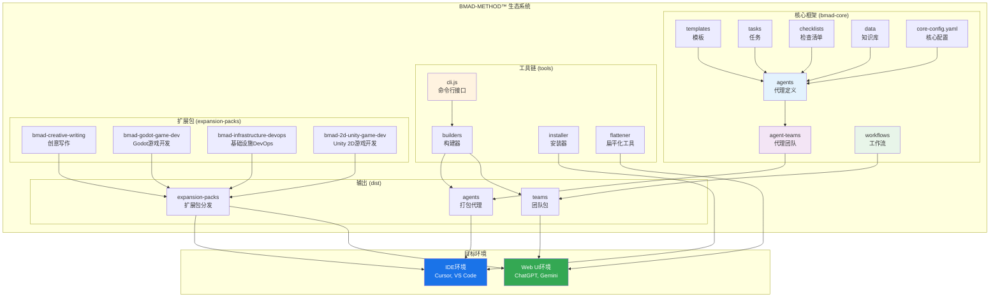
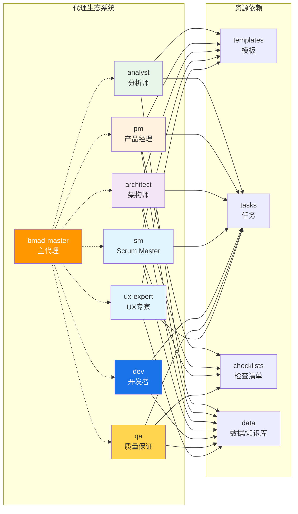
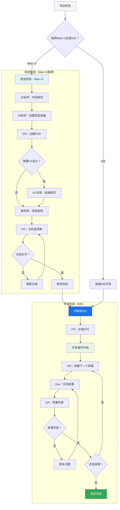
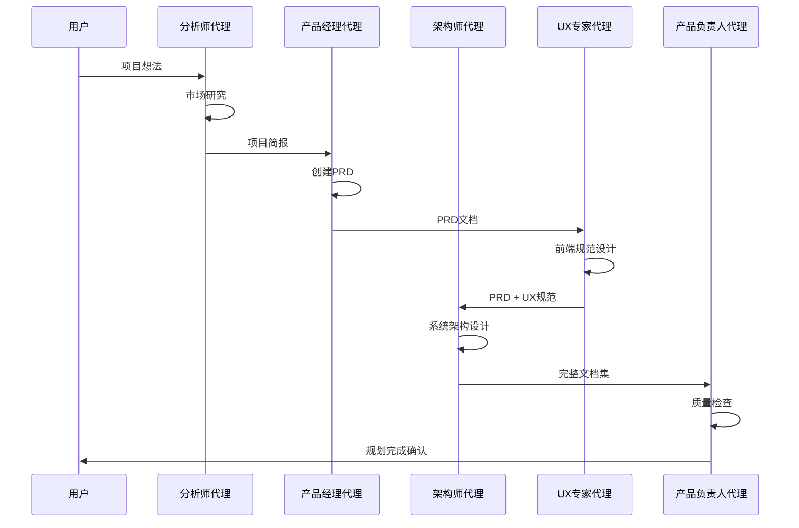
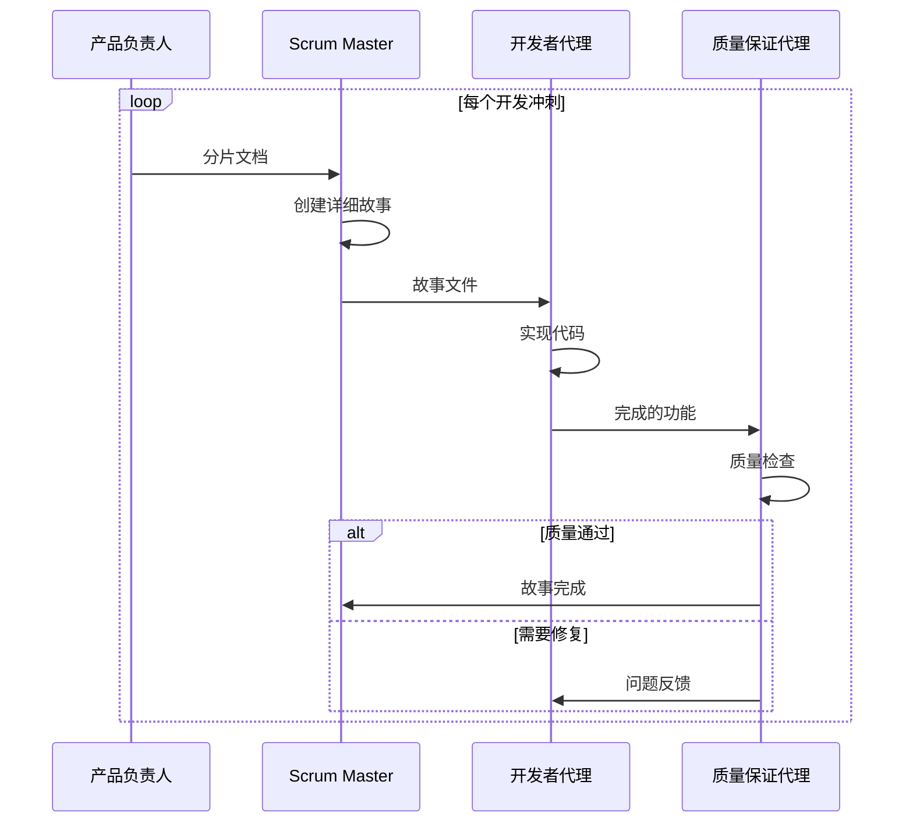
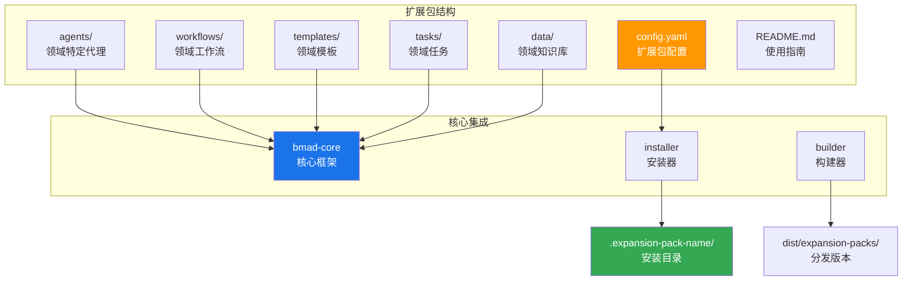

# BMAD-METHOD™ 技术文档

[](https://www.npmjs.com/package/bmad-method)
[](LICENSE)
[](https://nodejs.org)

## 目录

- [项目概述](#项目概述)
- [技术栈说明](#技术栈说明)
- [系统架构](#系统架构)
- [目录结构详解](#目录结构详解)
- [安装和运行指南](#安装和运行指南)
- [核心功能模块](#核心功能模块)
- [数据流程说明](#数据流程说明)
- [扩展包机制](#扩展包机制)
- [配置文件说明](#配置文件说明)
- [开发指南](#开发指南)
- [常见问题](#常见问题)

## 项目概述

### 什么是 BMAD-METHOD™？

BMAD-METHOD™（Breakthrough Method of Agile AI-driven Development）是一个通用的AI代理框架，专门设计用于将AI助手转化为专业的敏捷开发团队。它不仅仅是一个任务运行器，而是一个完整的AI驱动的开发方法论。

### 核心创新

**1. 代理式规划（Agentic Planning）**
- 专门的代理（分析师、产品经理、架构师）协作创建详细、一致的PRD和架构文档
- 通过高级提示工程和人机协作循环，产生超越通用AI任务生成的全面规范

**2. 上下文工程开发（Context-Engineered Development）**
- Scrum Master代理将详细计划转换为超详细的开发故事
- 每个故事文件包含开发代理所需的完整上下文、实现细节和架构指导

### 主要特性

- **模块化代理系统**：每个敏捷角色都有专门的AI代理
- **双环境支持**：同时优化Web UI和IDE环境
- **可重用资源**：便携式模板、任务和检查清单
- **斜杠命令集成**：快速代理切换和控制
- **扩展包支持**：扩展到软件开发之外的任何领域

## 技术栈说明

### 核心技术

| 技术 | 版本要求 | 用途 |
|------|----------|------|
| **Node.js** | ≥20.10.0 | 运行时环境 |
| **JavaScript** | ES2022+ | 主要编程语言 |
| **YAML** | - | 配置和模板定义 |
| **Markdown** | - | 文档和代理定义 |

### 依赖库

#### 核心依赖
```json
{
  "@kayvan/markdown-tree-parser": "^1.6.1",  // Markdown解析
  "chalk": "^4.1.2",                         // 终端颜色输出
  "commander": "^14.0.0",                    // CLI命令处理
  "fs-extra": "^11.3.1",                    // 文件系统操作
  "glob": "^11.0.3",                        // 文件模式匹配
  "inquirer": "^8.2.6",                     // 交互式命令行
  "js-yaml": "^4.1.0",                      // YAML处理
  "semver": "^7.7.2"                        // 版本管理
}
```

#### 开发依赖
```json
{
  "eslint": "^9.34.0",           // 代码检查
  "prettier": "^3.6.2",         // 代码格式化
  "jest": "^30.0.5",            // 测试框架
  "husky": "^9.1.7",            // Git钩子
  "semantic-release": "24.2.7"   // 自动发布
}
```

### 支持的环境

- **IDE环境**：Cursor、VS Code、WebStorm等
- **Web UI环境**：ChatGPT、Gemini、Claude等
- **操作系统**：Windows、macOS、Linux

## 系统架构

### 整体架构图



### 核心组件关系



## 目录结构详解

### 根目录结构

```
BMAD-METHOD/
├── bmad-core/              # 核心框架 - 系统的"大脑"
├── expansion-packs/        # 扩展包 - 领域特定功能
├── tools/                  # 工具链 - 构建、安装、CLI
├── dist/                   # 分发文件 - 打包后的代理和团队
├── docs/                   # 文档 - 用户指南和架构文档
├── common/                 # 通用工具和任务
├── package.json           # 项目配置和依赖
├── README.md              # 项目介绍
└── TECHNICAL_DOCUMENTATION.md  # 本技术文档
```

### bmad-core/ - 核心框架

这是整个系统的核心，包含所有基础组件：

```
bmad-core/
├── agents/                 # 代理定义文件
│   ├── bmad-master.md     # 主代理 - 协调其他代理
│   ├── analyst.md         # 分析师 - 市场研究和需求分析
│   ├── pm.md              # 产品经理 - PRD创建和管理
│   ├── architect.md       # 架构师 - 系统架构设计
│   ├── sm.md              # Scrum Master - 故事创建和管理
│   ├── dev.md             # 开发者 - 代码实现
│   ├── qa.md              # 质量保证 - 测试和验证
│   └── ux-expert.md       # UX专家 - 用户体验设计
├── agent-teams/           # 预定义的代理团队组合
│   ├── team-all.yaml     # 完整团队
│   ├── team-fullstack.yaml # 全栈开发团队
│   └── team-no-ui.yaml   # 无UI后端团队
├── workflows/             # 工作流定义
│   ├── greenfield-*.yaml # 新项目工作流
│   └── brownfield-*.yaml # 现有项目工作流
├── templates/             # 文档模板
│   ├── prd-tmpl.yaml     # PRD模板
│   ├── architecture-tmpl.yaml # 架构模板
│   └── story-tmpl.yaml   # 用户故事模板
├── tasks/                 # 可重用任务
│   ├── create-doc.md     # 文档创建任务
│   ├── shard-doc.md      # 文档分片任务
│   └── create-next-story.md # 故事创建任务
├── checklists/           # 质量检查清单
│   ├── pm-checklist.md   # PM检查清单
│   └── story-dod-checklist.md # 故事完成定义
├── data/                 # 知识库和数据
│   ├── bmad-kb.md        # BMAD知识库
│   └── technical-preferences.md # 技术偏好
└── core-config.yaml      # 核心配置文件

### tools/ - 工具链

提供构建、安装和管理功能的工具集：

```
tools/
├── cli.js                 # 主命令行接口
├── bmad-npx-wrapper.js   # NPX包装器
├── builders/             # 构建工具
│   └── web-builder.js    # Web环境构建器
├── installer/            # 安装器
│   ├── bin/bmad.js      # 安装命令
│   ├── lib/             # 安装逻辑
│   └── config/          # 安装配置
├── flattener/           # 代码扁平化工具
│   ├── main.js          # 主入口
│   ├── aggregate.js     # 聚合逻辑
│   └── discovery.js     # 文件发现
└── lib/                 # 共享库
    ├── dependency-resolver.js # 依赖解析
    └── yaml-utils.js    # YAML工具
```

### expansion-packs/ - 扩展包

领域特定的扩展包，将BMAD扩展到软件开发之外：

```
expansion-packs/
├── bmad-creative-writing/     # 创意写作扩展包
│   ├── agents/               # 写作相关代理
│   ├── workflows/            # 写作工作流
│   ├── templates/            # 写作模板
│   └── config.yaml          # 扩展包配置
├── bmad-godot-game-dev/      # Godot游戏开发
├── bmad-2d-unity-game-dev/   # Unity 2D游戏开发
├── bmad-infrastructure-devops/ # 基础设施DevOps
└── bmad-2d-phaser-game-dev/  # Phaser游戏开发
```

### dist/ - 分发目录

构建后的输出文件，用于不同环境的部署：

```
dist/
├── agents/               # 单个代理包
├── teams/               # 团队包（用于Web UI）
└── expansion-packs/     # 扩展包分发版本
```

## 安装和运行指南

### 环境要求

在开始之前，请确保您的系统满足以下要求：

- **Node.js**: 版本 ≥ 20.10.0
- **npm**: 版本 ≥ 8.0.0（通常随Node.js安装）
- **Git**: 用于版本控制（可选但推荐）

### 快速安装

#### 方法一：NPX安装（推荐）

这是最简单的安装方法，适用于新项目和现有项目：

```bash
# 在您的项目根目录运行
npx bmad-method install

# 或者明确使用稳定版本
npx bmad-method@stable install
```

#### 方法二：从源码安装

如果您想要最新的开发版本或需要自定义：

```bash
# 克隆仓库
git clone https://github.com/bmadcode/bmad-method.git
cd bmad-method

# 安装依赖
npm install

# 构建并安装到目标目录
npm run install:bmad
```

### 安装过程详解

安装器会自动执行以下步骤：

1. **检测现有安装**：自动识别v4安装并进行升级
2. **创建目录结构**：设置必要的文件夹
3. **复制核心文件**：安装bmad-core到`.bmad/`目录
4. **安装扩展包**：根据package.json中的配置安装扩展包
5. **配置IDE**：设置IDE特定的配置（如果支持）
6. **创建配置文件**：生成`core-config.yaml`

### 验证安装

安装完成后，验证是否成功：

```bash
# 检查安装的代理
npm run list:agents

# 验证配置
npm run validate

# 构建测试
npm run build
```

### 更新现有安装

保持BMAD安装最新非常重要：

```bash
# 如果已经安装了BMAD
git pull
npm run install:bmad

# 或者使用NPX重新安装
npx bmad-method install
```

更新过程会：
- ✅ 自动检测现有v4安装
- ✅ 只更新已更改的文件
- ✅ 为自定义修改创建`.bak`备份文件
- ✅ 保留项目特定配置

## 核心功能模块

### 代理系统（Agents）

BMAD的核心是其代理系统，每个代理都是一个专门的AI助手，具有特定的角色和能力。

#### 代理结构

每个代理文件（`.md`格式）包含：

```yaml
---
agent_id: agent-name
agent_name: "Agent Display Name"
agent_persona: "Detailed persona description"
agent_capabilities:
  - capability1
  - capability2
dependencies:
  templates:
    - template1.yaml
  tasks:
    - task1.md
  checklists:
    - checklist1.md
  data:
    - knowledge-base.md
startup_instructions: |
  Instructions executed when agent starts
---

# Agent Documentation
Detailed agent behavior and usage instructions...
```

#### 核心代理详解

**1. bmad-master（主代理）**
- **作用**：协调其他代理，提供帮助和指导
- **能力**：访问所有资源，代理切换，工作流管理
- **使用场景**：项目启动、代理协调、问题解决

**2. analyst（分析师）**
- **作用**：市场研究、竞争分析、需求收集
- **能力**：头脑风暴、深度研究、项目简报创建
- **输出**：项目简报、市场研究报告、竞争分析

**3. pm（产品经理）**
- **作用**：产品需求文档（PRD）创建和管理
- **能力**：需求分析、功能规划、史诗和故事定义
- **输出**：PRD文档、功能需求、非功能需求

**4. architect（架构师）**
- **作用**：系统架构设计和技术决策
- **能力**：架构设计、技术栈选择、系统集成规划
- **输出**：架构文档、技术规范、设计决策

**5. sm（Scrum Master）**
- **作用**：敏捷流程管理、用户故事创建
- **能力**：故事分解、冲刺规划、团队协调
- **输出**：用户故事、任务分解、冲刺计划

**6. dev（开发者）**
- **作用**：代码实现和技术开发
- **能力**：编码、调试、代码审查、技术实现
- **输出**：源代码、技术文档、实现方案

**7. qa（质量保证）**
- **作用**：测试策略和质量控制
- **能力**：测试设计、质量评估、缺陷管理
- **输出**：测试计划、质量报告、测试用例

**8. ux-expert（UX专家）**
- **作用**：用户体验设计和界面规划
- **能力**：UI设计、用户研究、交互设计
- **输出**：UI规范、设计原型、用户体验指南

### 模板系统（Templates）

BMAD使用YAML格式的模板系统来标准化文档创建：

#### 模板结构

```yaml
# 模板示例：PRD模板
template:
  id: prd-template-v4
  name: Product Requirements Document
  version: 4.0
  output:
    format: markdown
    filename: docs/prd.md
    title: "{{project_name}} - Product Requirements Document"

workflow:
  mode: interactive
  elicitation: advanced-elicitation

sections:
  - id: overview
    title: "项目概述"
    required: true
    prompts:
      - "描述项目的核心目标和价值主张"
      - "定义目标用户群体"

  - id: functional_requirements
    title: "功能需求"
    required: true
    prompts:
      - "列出核心功能特性"
      - "定义用户交互流程"
```

#### 核心模板

1. **prd-tmpl.yaml** - 产品需求文档模板
2. **architecture-tmpl.yaml** - 架构文档模板
3. **story-tmpl.yaml** - 用户故事模板
4. **project-brief-tmpl.yaml** - 项目简报模板

### 任务系统（Tasks）

任务是可重用的指令集，定义了特定操作的执行步骤：

#### 关键任务

**1. create-doc.md** - 文档创建任务
```markdown
# 任务：创建文档

## 目标
使用指定模板创建结构化文档

## 步骤
1. 选择适当的模板
2. 收集必要信息
3. 执行高级启发式对话
4. 生成最终文档
5. 验证文档完整性
```

**2. shard-doc.md** - 文档分片任务
- 将大型文档分解为可管理的小文件
- 保持文档间的引用关系
- 便于并行开发和维护

**3. create-next-story.md** - 故事创建任务
- 基于PRD和架构创建详细的用户故事
- 包含验收标准和技术实现指导
- 确保故事的可测试性和完整性

### 工作流系统（Workflows）

工作流定义了代理之间的协作序列和项目执行路径：

#### 工作流类型

**1. Greenfield工作流**（新项目）
- `greenfield-fullstack.yaml` - 全栈项目
- `greenfield-ui.yaml` - 前端项目
- `greenfield-service.yaml` - 后端服务

**2. Brownfield工作流**（现有项目）
- `brownfield-fullstack.yaml` - 现有全栈项目
- `brownfield-ui.yaml` - 现有前端项目
- `brownfield-service.yaml` - 现有后端服务

#### 工作流结构

```yaml
workflow:
  id: greenfield-fullstack
  name: "Greenfield Full Stack Development"
  description: "Complete workflow for new full-stack projects"

phases:
  ideation:
    - agent: analyst
      task: brainstorm-premise
      output: project-brief.md
    - agent: pm
      task: create-prd
      input: project-brief.md
      output: prd.md

  architecture:
    - agent: architect
      task: design-architecture
      input: prd.md
      output: architecture.md

  development:
    - agent: sm
      task: create-stories
      input: [prd.md, architecture.md]
      output: stories/
    - agent: dev
      task: implement-story
      input: stories/
      output: code/
```

## 数据流程说明

### 完整开发流程图



### 数据流转详解

#### 1. 规划阶段数据流



#### 2. 开发阶段数据流



### 文件组织和数据持久化

#### 标准项目结构

```
your-project/
├── .bmad/                    # BMAD核心文件
│   ├── agents/              # 代理定义
│   ├── templates/           # 模板文件
│   ├── tasks/               # 任务定义
│   └── core-config.yaml     # 核心配置
├── docs/                    # 项目文档
│   ├── prd.md              # 产品需求文档
│   ├── architecture.md     # 架构文档
│   ├── prd/                # 分片PRD文件
│   ├── architecture/       # 分片架构文件
│   ├── stories/            # 用户故事
│   └── qa/                 # 质量保证文档
├── src/                    # 源代码
└── package.json           # 项目配置
```

#### 数据流转规则

1. **文档版本控制**：所有文档都应纳入Git版本控制
2. **文件命名约定**：
   - 故事文件：`{epic_num}.{story_num}.{story_title}.md`
   - 分片文件：`epic-{n}-{title}.md`
3. **状态管理**：通过文档中的状态字段跟踪进度
4. **依赖关系**：通过文件引用维护组件间关系

## 扩展包机制

### 扩展包概述

BMAD的扩展包系统允许将框架扩展到软件开发之外的任何领域。每个扩展包都是一个自包含的生态系统，提供特定领域的代理、模板和工作流。

### 扩展包架构



### 现有扩展包

#### 1. 创意写作扩展包（bmad-creative-writing）

**用途**：小说、剧本、故事创作
**特色代理**：
- `plot-architect` - 情节架构师
- `character-psychologist` - 角色心理学家
- `narrative-designer` - 叙事设计师
- `world-builder` - 世界构建师
- `editor` - 编辑

**工作流**：
- 小说创作流程
- 剧本开发流程
- 短篇故事创作
- 系列规划

#### 2. Godot游戏开发扩展包（bmad-godot-game-dev）

**用途**：使用Godot引擎的2D/3D游戏开发
**特色代理**：
- `game-architect` - 游戏架构师
- `game-dev` - 游戏开发者
- `game-qa` - 游戏测试
- `game-pm` - 游戏产品经理

**技术栈**：GDScript、C#、Godot Engine

#### 3. Unity 2D游戏开发扩展包（bmad-2d-unity-game-dev）

**用途**：Unity引擎2D游戏开发
**技术栈**：C#、Unity Engine
**特色**：2D游戏特定的模板和工作流

#### 4. 基础设施DevOps扩展包（bmad-infrastructure-devops）

**用途**：云基础设施和DevOps自动化
**特色代理**：
- `infrastructure-architect` - 基础设施架构师
- `devops-engineer` - DevOps工程师
- `platform-engineer` - 平台工程师

### 扩展包配置文件

每个扩展包都有一个`config.yaml`文件定义其属性：

```yaml
# 扩展包配置示例
name: bmad-creative-writing
version: 1.1.1
short-title: Creative Writing Studio
description: >-
  Comprehensive AI-powered creative writing framework providing specialized
  agents, workflows, and tools for fiction writers, screenwriters, and
  narrative designers.
author: Wes
slashPrefix: bmad-cw

# 依赖的核心代理
dependencies:
  agents:
    - bmad-master
    - po

# 质量保证配置
qa:
  qaLocation: docs/qa

# PRD配置
prd:
  prdFile: docs/prd.md
  prdVersion: v4
  prdSharded: true
  prdShardedLocation: docs/prd
  epicFilePattern: epic-{n}*.md

# 架构配置
architecture:
  architectureFile: docs/architecture.md
  architectureVersion: v4
  architectureSharded: true
  architectureShardedLocation: docs/architecture

# 开发者始终加载的文件
devLoadAlwaysFiles:
  - docs/architecture/writing-standards.md
  - docs/architecture/narrative-structure.md
```

### 创建自定义扩展包

#### 1. 基本结构

```bash
# 创建扩展包目录
mkdir bmad-your-domain
cd bmad-your-domain

# 创建基本结构
mkdir -p agents workflows templates tasks data
touch config.yaml README.md
```

#### 2. 配置文件

```yaml
# config.yaml
name: bmad-your-domain
version: 1.0.0
short-title: Your Domain Pack
description: Description of your domain-specific functionality
author: Your Name
slashPrefix: your-prefix

dependencies:
  agents:
    - bmad-master  # 通常需要主代理

# 其他配置...
```

#### 3. 创建领域代理

```markdown
---
agent_id: domain-expert
agent_name: "Domain Expert"
agent_persona: "You are an expert in [your domain]..."
agent_capabilities:
  - domain-specific-capability-1
  - domain-specific-capability-2

dependencies:
  templates:
    - domain-template.yaml
  tasks:
    - domain-task.md
  data:
    - domain-knowledge.md
---

# Domain Expert Agent

This agent specializes in [your domain] and provides...
```

#### 4. 安装扩展包

```bash
# 将扩展包添加到package.json
{
  "bmad": {
    "expansionPacks": ["bmad-your-domain"]
  }
}

# 重新安装BMAD
npx bmad-method install
```

## 配置文件说明

### core-config.yaml - 核心配置

这是BMAD v4的关键创新，提供了最大的灵活性和向后兼容性：

```yaml
# 核心配置文件示例
version: 4.0.0

# PRD配置
prd:
  prdFile: docs/prd.md              # PRD主文件位置
  prdVersion: v4                    # PRD版本（v3或v4）
  prdSharded: true                  # 是否分片
  prdShardedLocation: docs/prd      # 分片文件位置
  epicFilePattern: epic-{n}*.md     # 史诗文件命名模式

# 架构配置
architecture:
  architectureFile: docs/architecture.md
  architectureVersion: v4
  architectureSharded: true
  architectureShardedLocation: docs/architecture

# 开发者配置
dev:
  devLoadAlwaysFiles:               # 开发者始终加载的文件
    - docs/architecture/coding-standards.md
    - docs/architecture/tech-stack.md
  devDebugLog: .ai/debug-log.md     # 调试日志位置
  devStoryLocation: docs/stories    # 故事文件位置

# QA配置
qa:
  qaLocation: docs/qa               # QA文档位置
  qaLoadAlwaysFiles:
    - docs/architecture/testing-strategy.md

# 其他配置
agentCoreDump: .ai/conversations    # 对话导出位置
customTechnicalDocuments: null      # 自定义技术文档
```

### package.json - 项目配置

BMAD相关的package.json配置：

```json
{
  "name": "your-project",
  "version": "1.0.0",
  "bmad": {
    "version": "4.43.0",
    "expansionPacks": [
      "bmad-creative-writing",
      "bmad-godot-game-dev"
    ],
    "customConfig": {
      "prdLocation": "custom/prd.md",
      "architectureLocation": "custom/architecture.md"
    }
  },
  "scripts": {
    "bmad:install": "npx bmad-method install",
    "bmad:update": "git pull && npm run bmad:install",
    "bmad:validate": "npx bmad-method validate"
  }
}
```

### IDE配置文件

BMAD会为支持的IDE创建配置文件：

#### VS Code配置（.vscode/settings.json）

```json
{
  "bmad.agentPath": ".bmad/agents",
  "bmad.templatesPath": ".bmad/templates",
  "bmad.configPath": ".bmad/core-config.yaml",
  "files.associations": {
    "*.bmad": "markdown"
  }
}
```

#### Cursor配置

```json
{
  "cursor.bmad.enabled": true,
  "cursor.bmad.agentCommands": {
    "@sm": ".bmad/agents/sm.md",
    "@dev": ".bmad/agents/dev.md",
    "@qa": ".bmad/agents/qa.md"
  }
}

## 开发指南

### 最佳实践

#### 1. 项目规划最佳实践

**使用Web UI进行规划**
- 在Web UI（如ChatGPT、Gemini）中进行规划阶段，成本更低且质量更高
- 使用强大的思考模型进行复杂的规划任务
- 与代理协作，不要完全依赖自动化

**文档质量控制**
```markdown
# PRD质量检查清单
- [ ] 明确的项目目标和价值主张
- [ ] 详细的功能需求（FRs）
- [ ] 完整的非功能需求（NFRs）
- [ ] 清晰的用户故事和验收标准
- [ ] 技术约束和假设
```

#### 2. 开发周期最佳实践

**上下文管理**
- 始终使用新的、干净的上下文窗口
- 在SM、Dev和QA工作之间开始新的对话
- 选择最强大的模型进行SM故事创建

**故事开发流程**
```bash
# 推荐的开发流程
1. 新对话 → 选择强大模型 → @sm → *create
2. SM执行create-next-story任务
3. 审查生成的故事
4. 将状态从"Draft"更新为"Approved"
5. 新对话 → @dev → 实现故事
6. 新对话 → @qa → 质量检查
```

#### 3. 代码质量最佳实践

**技术偏好配置**
```yaml
# technical-preferences.md 示例
coding_standards:
  language: TypeScript
  framework: Next.js
  testing: Jest + Testing Library
  linting: ESLint + Prettier

architecture_patterns:
  - Clean Architecture
  - Domain-Driven Design
  - SOLID Principles

performance_requirements:
  - Core Web Vitals compliance
  - < 3s page load time
  - 95%+ test coverage
```

#### 4. 团队协作最佳实践

**代理切换策略**
- 使用`@agent-name`快速切换代理
- 每个代理专注于其专业领域
- 避免让单个代理承担多个角色

**文档维护**
- 保持文档与代码同步
- 定期运行验证命令
- 使用版本控制跟踪所有更改

### 故障排除指南

#### 常见问题和解决方案

**1. 安装问题**

```bash
# 问题：NPX安装失败
# 解决方案：清除缓存并重试
npm cache clean --force
npx clear-npx-cache
npx bmad-method@latest install

# 问题：权限错误
# 解决方案：检查目录权限
chmod -R 755 .bmad/
```

**2. 代理无法加载**

```bash
# 问题：代理文件找不到
# 解决方案：验证安装
npm run validate

# 问题：依赖缺失
# 解决方案：重新安装
npm run install:bmad
```

**3. 文档分片问题**

```yaml
# 问题：分片文件路径错误
# 解决方案：检查core-config.yaml
prd:
  prdShardedLocation: docs/prd  # 确保路径正确
  epicFilePattern: epic-{n}*.md # 确保模式正确
```

**4. 扩展包问题**

```json
// 问题：扩展包未加载
// 解决方案：检查package.json配置
{
  "bmad": {
    "expansionPacks": [
      "bmad-creative-writing"  // 确保名称正确
    ]
  }
}
```

### 性能优化

#### 1. 上下文窗口优化

**减少上下文大小**
- 只加载必要的文档
- 使用文档分片减少单个文件大小
- 定期清理不需要的文件

**智能文件加载**
```yaml
# 配置开发者始终加载的关键文件
devLoadAlwaysFiles:
  - docs/architecture/coding-standards.md
  - docs/architecture/tech-stack.md
  # 避免加载过多文件
```

#### 2. 构建优化

```bash
# 只构建需要的组件
npm run build:agents    # 只构建代理
npm run build:teams     # 只构建团队

# 使用缓存加速构建
npm run build --cache
```

#### 3. 内存使用优化

```javascript
// 在大型项目中使用流式处理
const config = {
  streaming: true,
  batchSize: 10,
  maxConcurrency: 3
};
```

### 贡献指南

#### 1. 代码贡献

**Fork和分支策略**
```bash
# Fork仓库并克隆
git clone https://github.com/YOUR-USERNAME/BMAD-METHOD.git
cd BMAD-METHOD

# 创建功能分支
git checkout -b feature/amazing-feature

# 进行更改并测试
npm test
npm run lint

# 提交更改
git commit -m 'feat: add amazing feature'
git push origin feature/amazing-feature
```

**代码质量要求**
- 遵循ESLint和Prettier配置
- 编写测试用例
- 更新相关文档
- 通过所有CI检查

#### 2. 扩展包贡献

**创建新扩展包**
1. 在`expansion-packs/`目录创建新文件夹
2. 实现必要的代理、模板和工作流
3. 编写详细的README和使用指南
4. 提交PR并请求审查

**扩展包质量标准**
- 完整的配置文件
- 至少3个专业代理
- 完整的工作流定义
- 详细的文档和示例

#### 3. 文档贡献

**文档改进**
- 修复错误和不准确信息
- 添加缺失的示例
- 改进可读性和结构
- 翻译到其他语言

### 测试策略

#### 1. 单元测试

```javascript
// 测试代理加载
describe('Agent Loading', () => {
  test('should load all core agents', async () => {
    const agents = await loadAgents('.bmad/agents');
    expect(agents).toHaveLength(8);
    expect(agents.map(a => a.id)).toContain('dev');
  });
});
```

#### 2. 集成测试

```javascript
// 测试完整工作流
describe('Greenfield Workflow', () => {
  test('should complete full planning cycle', async () => {
    const workflow = new GreenfieldWorkflow();
    const result = await workflow.execute();
    expect(result.status).toBe('completed');
    expect(result.artifacts).toContain('prd.md');
  });
});
```

#### 3. 端到端测试

```bash
# 测试完整安装和使用流程
npm run test:e2e

# 测试特定扩展包
npm run test:expansion-pack bmad-creative-writing
```

## 常见问题

### 安装和配置

**Q: 如何在现有项目中安装BMAD？**
A: 在项目根目录运行`npx bmad-method install`。安装器会自动检测现有结构并进行适配。

**Q: 可以自定义文档位置吗？**
A: 是的，通过修改`core-config.yaml`中的路径配置：
```yaml
prd:
  prdFile: custom/path/prd.md
architecture:
  architectureFile: custom/path/architecture.md
```

**Q: 如何更新到最新版本？**
A: 运行`git pull && npm run install:bmad`或`npx bmad-method install`。

### 使用问题

**Q: 代理无响应或行为异常怎么办？**
A:
1. 检查代理文件是否正确加载：`npm run validate`
2. 确保使用新的上下文窗口
3. 验证依赖文件是否存在

**Q: 如何在Web UI和IDE之间切换？**
A:
1. Web UI用于规划阶段（成本低、质量高）
2. 完成PRD和架构后切换到IDE
3. 在IDE中进行文档分片和开发

**Q: 扩展包安装失败怎么办？**
A:
1. 检查package.json中的扩展包名称
2. 确保扩展包存在于expansion-packs目录
3. 重新运行安装：`npm run install:bmad`

### 开发问题

**Q: 如何处理大型项目的上下文限制？**
A:
1. 使用文档分片功能
2. 配置`devLoadAlwaysFiles`只加载关键文件
3. 定期清理不需要的文档

**Q: 可以自定义代理行为吗？**
A: 是的，可以：
1. 修改代理的markdown文件
2. 创建自定义扩展包
3. 调整technical-preferences.md

**Q: 如何集成现有的开发工具？**
A: BMAD支持多种IDE集成，并可以通过配置文件自定义工具链集成。

### 扩展和定制

**Q: 如何创建自己的扩展包？**
A:
1. 在expansion-packs目录创建新文件夹
2. 实现config.yaml、代理、模板等
3. 参考现有扩展包的结构

**Q: 可以修改核心代理吗？**
A: 建议通过扩展包方式添加功能，而不是直接修改核心代理，以保持升级兼容性。

**Q: 如何贡献代码或扩展包？**
A:
1. Fork仓库并创建功能分支
2. 实现功能并编写测试
3. 提交PR并等待审查

---

## 学习资源

### 官方资源

- **[用户指南](docs/user-guide.md)** - 完整的使用教程
- **[核心架构](docs/core-architecture.md)** - 技术深度解析
- **[扩展包指南](docs/expansion-packs.md)** - 扩展包开发指南
- **[贡献指南](CONTRIBUTING.md)** - 如何参与项目

### 社区资源

- **[Discord社区](https://discord.gg/gk8jAdXWmj)** - 获取帮助和分享想法
- **[GitHub讨论](https://github.com/bmadcode/bmad-method/discussions)** - 技术讨论
- **[YouTube频道](https://www.youtube.com/@BMadCode)** - 视频教程和演示

### 相关技术学习

- **敏捷开发方法论** - 了解Scrum、看板等敏捷实践
- **AI提示工程** - 学习如何更好地与AI代理协作
- **Markdown语法** - 掌握文档编写格式
- **YAML配置** - 理解配置文件结构

---

*本文档持续更新中。如有问题或建议，请通过GitHub Issues或Discord社区反馈。*

**版权声明**: BMAD™ 和 BMAD-METHOD™ 是 BMad Code, LLC 的商标。保留所有权利。
```
```
