# BMAD-METHOD™ vs Spec Kit 技术文档比对分析

## 📋 目录

- [概述对比](#概述对比)
- [核心理念差异](#核心理念差异)
- [技术栈对比](#技术栈对比)
- [架构设计差异](#架构设计差异)
- [功能模块对比](#功能模块对比)
- [工作流程差异](#工作流程差异)
- [目录结构对比](#目录结构对比)
- [配置管理差异](#配置管理差异)
- [用户体验对比](#用户体验对比)
- [扩展性分析](#扩展性分析)
- [适用场景分析](#适用场景分析)
- [总结与建议](#总结与建议)

## 概述对比

### 项目定位对比

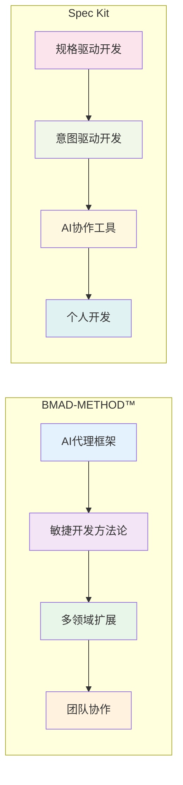

### 核心价值主张

| 维度 | BMAD-METHOD™ | Spec Kit |
|------|-------------|----------|
| **主要目标** | 将AI助手转化为专业敏捷开发团队 | 实现规格驱动的软件开发 |
| **核心理念** | 代理式规划 + 上下文工程开发 | 意图驱动 + 多步骤精化 |
| **适用范围** | 软件开发 + 多领域扩展 | 主要专注软件开发 |
| **团队规模** | 支持团队协作 | 主要面向个人开发者 |
| **AI集成** | 多种AI平台支持 | 深度依赖特定AI模型 |

## 核心理念差异

### 开发方法论对比


### 核心创新点

**BMAD-METHOD™ 的创新**：
1. **代理式规划**：专门代理协作创建详细规范
2. **上下文工程开发**：故事文件包含完整实现上下文
3. **双环境支持**：Web UI + IDE 环境优化
4. **扩展包机制**：支持任何领域的扩展

**Spec Kit 的创新**：
1. **规格驱动开发**：规格说明书成为可执行核心
2. **意图驱动开发**：先定义"是什么"再考虑"怎么做"
3. **多步骤精化**：结构化流程逐步完善
4. **AI深度集成**：依赖AI的规格解释能力

## 技术栈对比

### 技术选型差异

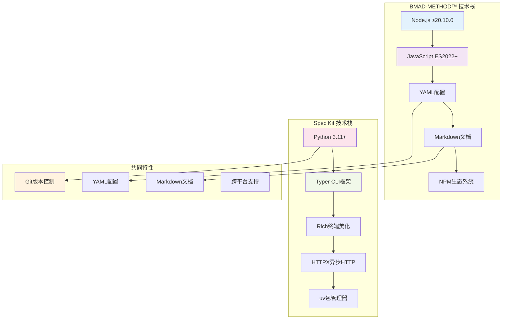

### 依赖管理对比

| 方面 | BMAD-METHOD™ | Spec Kit |
|------|-------------|----------|
| **包管理器** | NPM/PNPM | uv (推荐) |
| **核心依赖数量** | 9个核心依赖 | 5个核心依赖 |
| **构建工具** | 自定义构建脚本 | Hatchling |
| **分发方式** | NPM包 + Git | Python包 + Git |
| **安装复杂度** | 中等 | 简单 |

## 架构设计差异

### 系统架构对比

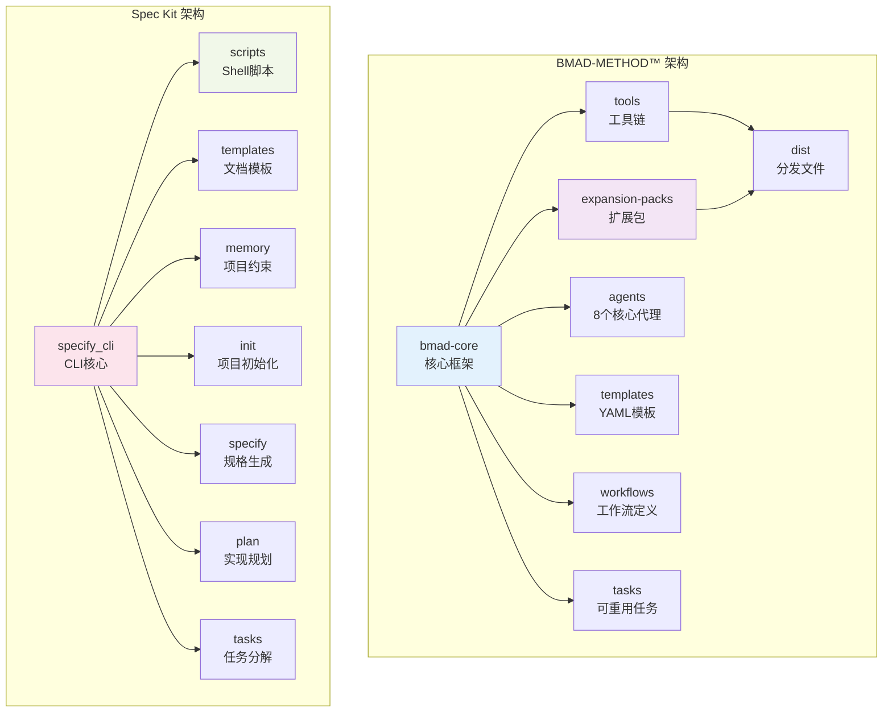

### 模块化程度对比

**BMAD-METHOD™**：
- ✅ 高度模块化（8个独立代理）
- ✅ 可插拔扩展包系统
- ✅ 分层架构设计
- ✅ 组件间松耦合

**Spec Kit**：
- ✅ 功能模块化（4个核心命令）
- ⚠️ 相对简单的架构
- ✅ 模板系统分离
- ⚠️ 组件间紧耦合

## 功能模块对比

### 核心功能对比矩阵

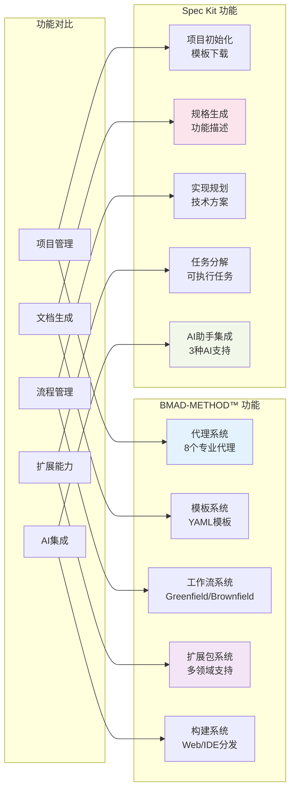

### 功能深度对比

| 功能领域 | BMAD-METHOD™ | Spec Kit | 优势对比 |
|----------|-------------|----------|----------|
| **项目初始化** | ⭐⭐⭐ | ⭐⭐⭐⭐⭐ | Spec Kit更简洁 |
| **需求分析** | ⭐⭐⭐⭐⭐ | ⭐⭐⭐ | BMAD更专业 |
| **架构设计** | ⭐⭐⭐⭐⭐ | ⭐⭐⭐⭐ | BMAD更全面 |
| **任务管理** | ⭐⭐⭐⭐ | ⭐⭐⭐⭐ | 相当 |
| **代码生成** | ⭐⭐⭐ | ⭐⭐⭐⭐ | Spec Kit更直接 |
| **质量保证** | ⭐⭐⭐⭐⭐ | ⭐⭐⭐ | BMAD更完整 |
| **团队协作** | ⭐⭐⭐⭐⭐ | ⭐⭐ | BMAD明显优势 |
| **扩展性** | ⭐⭐⭐⭐⭐ | ⭐⭐⭐ | BMAD更强 |

## 工作流程差异

### 开发流程对比

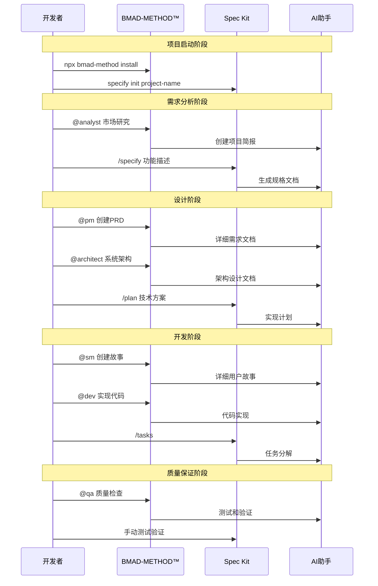

### 流程复杂度对比

**BMAD-METHOD™**：
- 🔄 多阶段流程（8个代理角色）
- 📋 详细的检查清单
- 🔀 支持迭代和回退
- 👥 团队协作流程
- ⏱️ 较长的学习曲线

**Spec Kit**：
- 🔄 简化流程（4个核心步骤）
- 📝 直接的文档生成
- ➡️ 线性流程设计
- 👤 个人开发优化
- ⚡ 快速上手

## 目录结构对比

### 项目组织方式差异

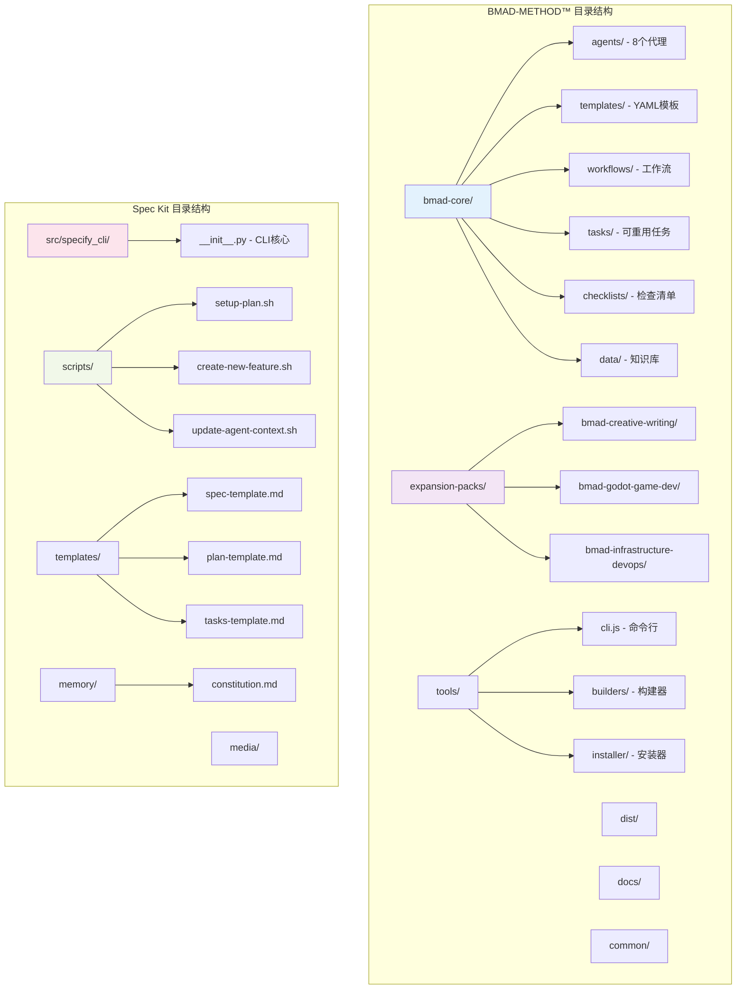

### 文件组织复杂度

| 维度 | BMAD-METHOD™ | Spec Kit |
|------|-------------|----------|
| **总文件数** | 100+ 文件 | 20+ 文件 |
| **目录层级** | 3-4层深度 | 2-3层深度 |
| **配置文件** | 多个YAML配置 | 单个TOML配置 |
| **模板数量** | 15+ 模板文件 | 4个核心模板 |
| **脚本数量** | 10+ JavaScript文件 | 6个Shell脚本 |
| **文档数量** | 8+ 技术文档 | 3个核心文档 |

## 配置管理差异

### 配置文件对比

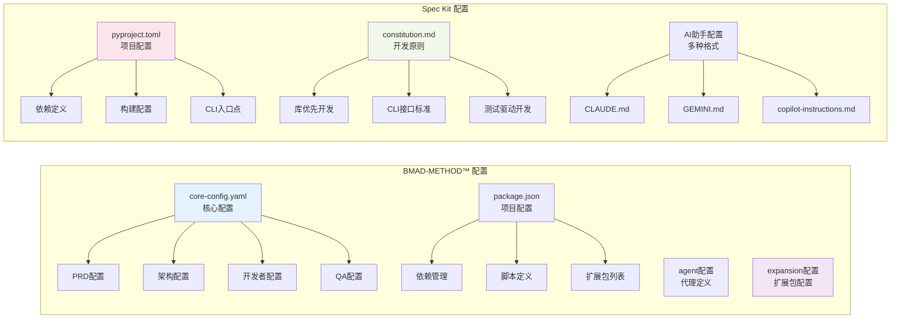

### 配置复杂度分析

**BMAD-METHOD™ 配置特点**：
- ✅ 高度可配置（支持v3/v4版本）
- ✅ 灵活的文档路径配置
- ✅ 扩展包独立配置
- ⚠️ 配置项较多，学习成本高
- ✅ 向后兼容性强

**Spec Kit 配置特点**：
- ✅ 简洁的配置结构
- ✅ 标准Python项目配置
- ✅ 清晰的开发原则定义
- ✅ 易于理解和修改
- ⚠️ 配置选项相对有限

## 用户体验对比

### 安装体验对比

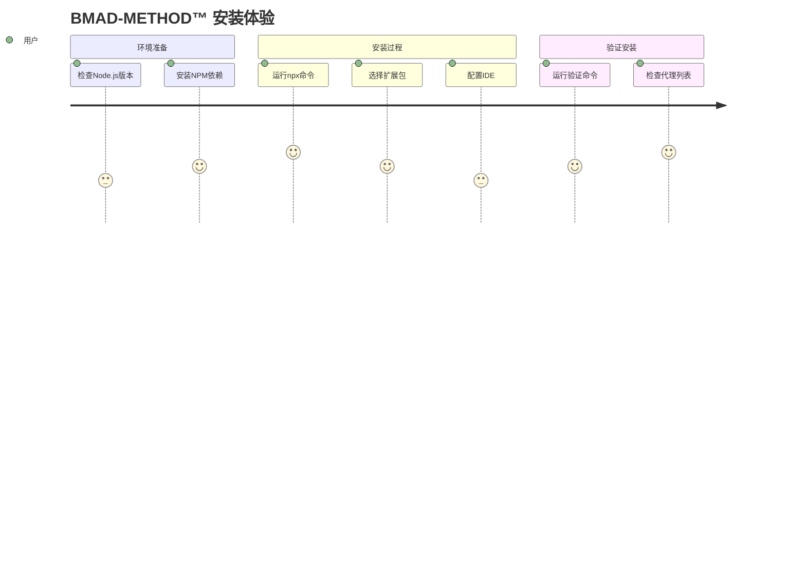

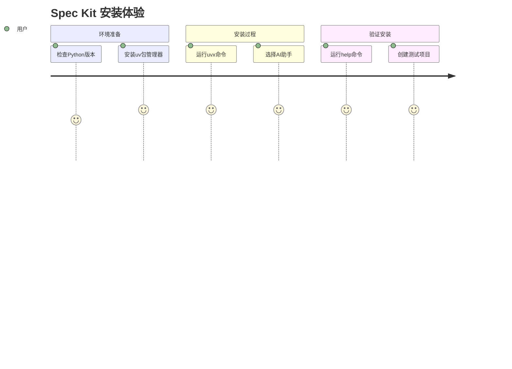

### 学习曲线对比

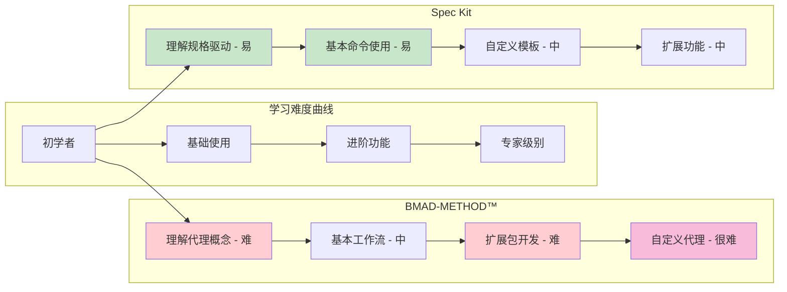

### 用户反馈维度

| 体验维度 | BMAD-METHOD™ | Spec Kit | 说明 |
|----------|-------------|----------|------|
| **上手难度** | ⭐⭐ | ⭐⭐⭐⭐⭐ | Spec Kit更容易上手 |
| **功能丰富度** | ⭐⭐⭐⭐⭐ | ⭐⭐⭐ | BMAD功能更丰富 |
| **文档质量** | ⭐⭐⭐⭐ | ⭐⭐⭐⭐ | 两者文档都较完善 |
| **错误处理** | ⭐⭐⭐ | ⭐⭐⭐⭐ | Spec Kit错误信息更清晰 |
| **性能表现** | ⭐⭐⭐ | ⭐⭐⭐⭐⭐ | Spec Kit启动更快 |
| **扩展能力** | ⭐⭐⭐⭐⭐ | ⭐⭐⭐ | BMAD扩展性更强 |

## 扩展性分析

### 扩展机制对比

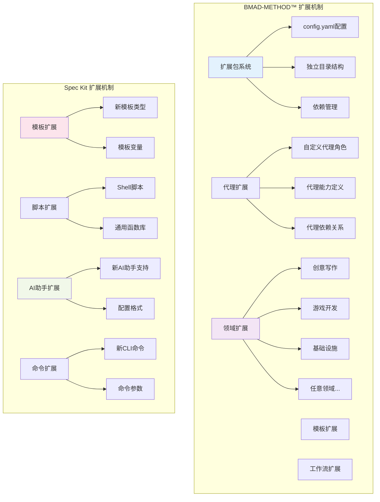

### 扩展能力评估

**BMAD-METHOD™ 扩展优势**：
- 🎯 **领域无关性**：可扩展到任何专业领域
- 🔧 **模块化设计**：每个扩展包独立完整
- 🤝 **代理协作**：支持复杂的多代理交互
- 📦 **包管理**：完整的扩展包生命周期管理
- 🔄 **版本兼容**：支持多版本共存

**Spec Kit 扩展优势**：
- ⚡ **简单直接**：扩展机制简单易懂
- 🛠️ **脚本化**：基于Shell脚本的灵活扩展
- 🎨 **模板化**：易于创建新的文档模板
- 🔌 **插件式**：支持新AI助手的快速集成
- 📝 **配置驱动**：通过配置文件控制行为

## 适用场景分析

### 使用场景矩阵

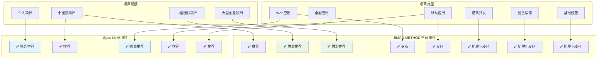

### 详细场景分析

#### 个人开发者场景

**推荐：Spec Kit**
- ✅ 快速上手，学习成本低
- ✅ 简洁的工作流程
- ✅ 直接的代码生成
- ✅ 轻量级工具链

**BMAD-METHOD™ 的挑战**：
- ⚠️ 功能过于复杂
- ⚠️ 团队协作功能冗余
- ⚠️ 学习曲线陡峭

#### 小团队项目（2-5人）

**推荐：两者都适用**

**选择Spec Kit的情况**：
- 团队技术栈统一
- 项目周期较短
- 需要快速原型开发

**选择BMAD-METHOD™的情况**：
- 需要规范的开发流程
- 团队成员角色分工明确
- 项目复杂度较高

#### 中大型团队项目（5+人）

**推荐：BMAD-METHOD™**
- ✅ 完整的角色分工体系
- ✅ 标准化的协作流程
- ✅ 质量保证机制
- ✅ 扩展包支持多样化需求

**Spec Kit 的局限性**：
- ⚠️ 缺乏团队协作机制
- ⚠️ 个人开发导向
- ⚠️ 质量保证流程简单

## 总结与建议

### 综合评估矩阵

```mermaid
radar
    title 综合能力对比雷达图
    options
      scale: 0-5
      gridLevels: 5

    data
      BMAD-METHOD™: [5, 4, 5, 3, 5, 4, 3, 5]
      Spec Kit: [3, 5, 3, 5, 3, 4, 5, 3]

    labels
      功能完整性
      易用性
      扩展性
      性能
      团队协作
      文档质量
      学习曲线
      企业适用性
```

### 核心差异总结

| 对比维度 | BMAD-METHOD™ | Spec Kit | 关键差异 |
|----------|-------------|----------|----------|
| **设计哲学** | 代理协作 + 敏捷方法论 | 规格驱动 + 意图开发 | 团队 vs 个人导向 |
| **技术实现** | Node.js + 复杂架构 | Python + 简洁设计 | 复杂 vs 简单 |
| **学习成本** | 高（需要理解代理概念） | 低（直观的命令流程） | 专业 vs 易用 |
| **适用规模** | 中大型团队项目 | 个人和小团队项目 | 企业 vs 个人 |
| **扩展能力** | 强（多领域扩展包） | 中（模板和脚本扩展） | 生态 vs 工具 |
| **AI集成** | 多平台支持 | 深度集成特定AI | 广度 vs 深度 |

### 选择建议决策树

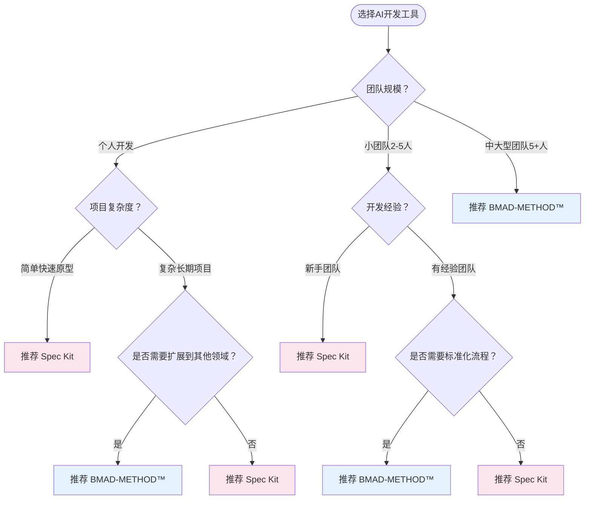

### 具体使用建议

#### 推荐使用 BMAD-METHOD™ 的场景

**✅ 强烈推荐**：
- 中大型软件开发团队（5+人）
- 需要标准化敏捷开发流程
- 多角色协作的复杂项目
- 需要扩展到非软件开发领域
- 企业级项目管理需求

**✅ 适合使用**：
- 有经验的开发团队
- 长期维护的项目
- 需要完整质量保证流程
- 多技术栈混合项目

#### 推荐使用 Spec Kit 的场景

**✅ 强烈推荐**：
- 个人开发者或小团队
- 快速原型开发
- 简单到中等复杂度项目
- 新手开发者学习AI辅助开发
- 需要快速上手的场景

**✅ 适合使用**：
- Python技术栈项目
- 注重开发效率的场景
- 规格驱动开发的实践
- 轻量级工具链需求

### 迁移和集成建议

#### 从传统开发迁移

**迁移到 BMAD-METHOD™**：
1. **阶段性引入**：先使用核心代理，逐步引入完整流程
2. **团队培训**：重点培训代理概念和协作流程
3. **模板定制**：根据团队习惯定制模板和检查清单
4. **扩展包选择**：根据业务需求选择合适的扩展包

**迁移到 Spec Kit**：
1. **快速试验**：在小项目中快速验证效果
2. **模板调整**：根据项目特点调整文档模板
3. **AI助手配置**：选择最适合的AI助手平台
4. **流程优化**：根据团队反馈优化工作流程

#### 工具组合使用

**可能的组合方案**：
- **学习阶段**：Spec Kit学习 → BMAD-METHOD™实践
- **项目阶段**：原型用Spec Kit → 正式开发用BMAD-METHOD™
- **团队阶段**：个人用Spec Kit → 团队用BMAD-METHOD™

### 未来发展趋势

#### BMAD-METHOD™ 发展方向

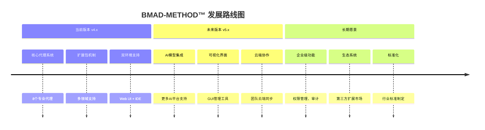

#### Spec Kit 发展方向

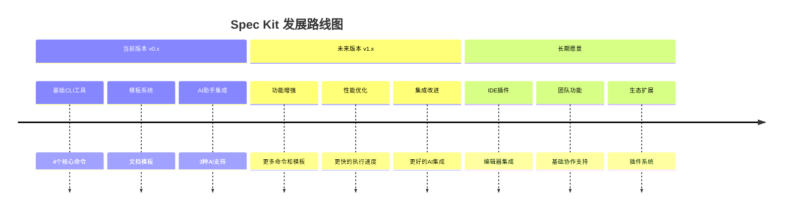

### 最终建议

#### 对于个人开发者
- 🎯 **首选 Spec Kit**：简单、快速、易上手
- 🔄 **进阶路径**：熟练后可考虑BMAD-METHOD™

#### 对于小团队
- 🤔 **评估需求**：根据项目复杂度和团队经验选择
- 📊 **试验对比**：可以在不同项目中试用两种工具

#### 对于中大型团队
- 🎯 **首选 BMAD-METHOD™**：完整的团队协作和质量保证
- 🛠️ **定制化**：根据组织需求定制扩展包和流程

#### 对于企业组织
- 📈 **长期投资 BMAD-METHOD™**：更好的可扩展性和标准化
- 🔧 **渐进式采用**：从试点项目开始，逐步推广

---

## 附录

### 参考资源

**BMAD-METHOD™ 相关资源**：
- [官方仓库](https://github.com/bmadcode/bmad-method)
- [用户指南](https://github.com/bmadcode/bmad-method/blob/main/docs/user-guide.md)
- [Discord社区](https://discord.gg/gk8jAdXWmj)
- [YouTube频道](https://www.youtube.com/@BMadCode)

**Spec Kit 相关资源**：
- [官方仓库](https://github.com/github/spec-kit)
- [技术文档](https://github.com/nicekate/spec-kit/blob/main/TECHNICAL_DOCUMENTATION.md)
- [Python包管理](https://packaging.python.org/)

### 版本信息

- **文档版本**：1.0
- **创建日期**：2025-09-09
- **最后更新**：2025-09-09
- **比对基准**：
  - BMAD-METHOD™ v4.43.0
  - Spec Kit v0.0.2

---

*本比对分析基于两个项目的当前技术文档，随着项目发展可能会有变化。建议定期更新此比对分析。*
